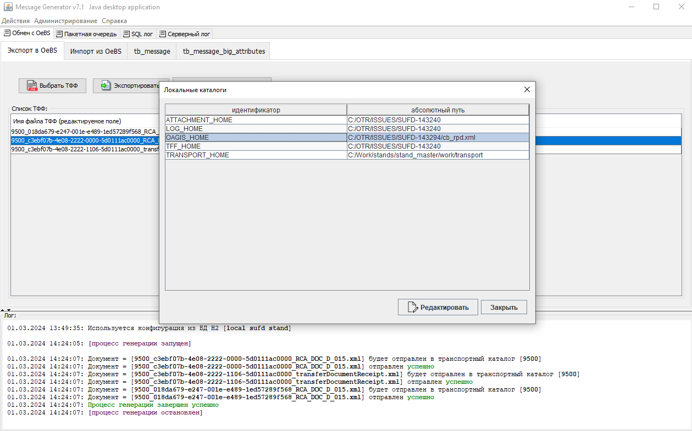
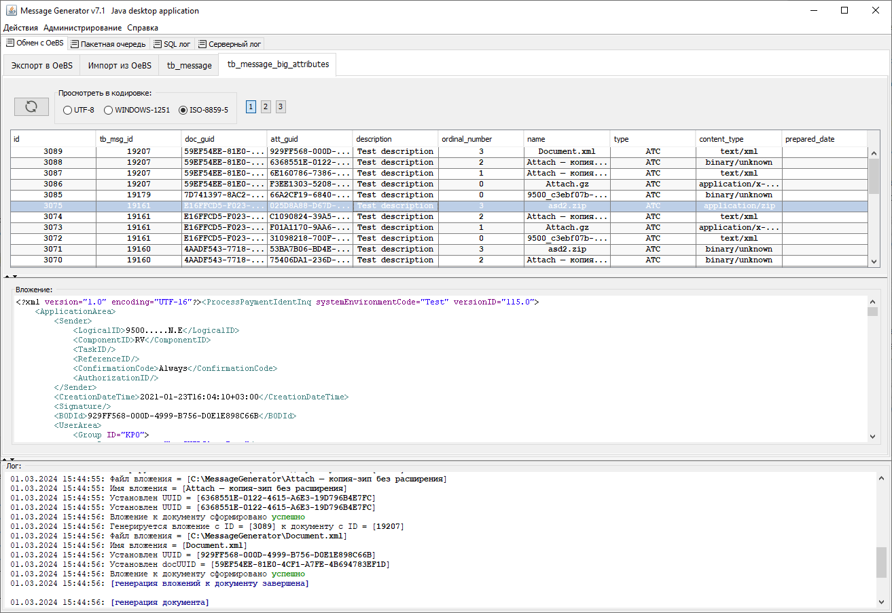

MessageGenerator: Java desktop app example
--
<h4>General description</h4>
The application shows some common approaches of building desktop Swing applications with using Spring framework:

<ul>
    <li>
        Saving XML documents with attachments to database tables, pagination;
    </li>
    <li>
        Viewing BLOB content of generated documents in different encodings;
    </li>
    <li>
       Support for multi-file attachments of arbitrary size, packed in zip and gzip archives;
    </li>
    <li>
       Editable metadata of XML documents (Content-Type, names);
    </li>
    <li>
        Built-in Hypersonic 2 database for storing database connection configurations, dynamic configuration switching;
    </li>
    <li>
        Viewing the V$SQL SQL log with full-text search by query text;
    </li>
    <li>
        Built-in log viewer with auto-update.
    </li>
</ul>

<h4>Architecture</h4>
The example is built with using Spring and multi-tier architecture (n-tier architecture) and consists of 4 levels:

- gui
- services
- dao
- core

The direction of dependencies is from the gui level to the core level, with each level depending only on the next level. 
All the business values are placed in separate threads from the Event Dispatch Thread.

<h4>Building</h4>

- Java 8: `mvn clean package`
- Java 7: `mvn -Dhttps.protocols=TLSv1.2 clean package`

If the build is successful, the executable fat jar will appear in the gui/target directory.

<h4>Distribution directories</h4>
The __distrib contains the following directories. 
<ul>
    <li><b>db</b> - this directory contains a file of the built-in H2 database MessageGenerator.mv.db, where stored a dump of configurations, 
                    the path to local transport directories and a list of available UI themes. The directory also contains scripts that are 
                     executed every time the application starts (scripts/update) and once when creating and initializing the embedded database (scripts/init).
    </li>
    <li><b>temp</b> - the service directory where archives are unpacked when generating attachments. The content can and should be deleted periodically.</li>
    <li><b>logs</b> - the directory contains the application's operation log. Logs are rotated by size and date. Similarly, it is advisable to delete the content.</li>
</ul>

<h4>Example</h4>
<i>Note: Here briefly described an example of how the application works, layouting, etc. is  without business details. "OeBS", "import and export", "TFF" - none of this matters here.
All of that can be adapted to a specific business case.</i>

The initial application window looks as shown below. 


Documents are added to the database tables. It is necessary to select the configuration that determines the connection to the stand.
The list of configurations is available in the menu <b>Admin</b> - <b>Configs</b>, the current active configuration is marked
in the <b>active</b> field. All the queries, messages and displayed data will be presented according to the selected configs.
If there is a need to connect to another database, then should specify a different configuration by editing the record,
or add a new one with an activity sign.


XML messages contains the templates <i>$uuid</i> and <i>$doc_uuid</i>:
<ul>
    <li><i>$uuid</i> - to generate random GUIDs;</li>
    <li><i>$doc_uuid</i> - to generate a random GUID that will be inserted into both the xml tag and the DOC_GUID field of the TB_MESSAGE_BIG_ATTRIBUTES table.
                           By this way uploaded XML linked with the attachment (for example, the value of the docGuid document tag will match the value of the 
                           DOC_GUID field in the TB_MESSAGE_BIG_ATTRIBUTES table).
    </li>
</ul>

If only the template <i>$uuid</i> is specified in the messages, or the message is loaded without templates, then in the ATT_GUID and
DOC_GUID fields of the table TB_MESSAGE_BIG_ATTRIBUTES will be set random values.

For example, if the following documents are selected:

```xml
<document>
	<docDuid>$doc_uuid</docDuid>
	<guid>$uuid</guid>
</document>
```
```xml
<attachment>
	<docDuid>$doc_uuid</docDuid>
</attachment>
```
Then it will be transformed to:

```xml
<document>
    <docDuid>55AB878E-1049-48A2-B32C-D937E1CD658B</docDuid>
    <guid>67C40B04-B451-4766-9324-CFC92C8D21F8</guid>
</document>
```
```xml
<attachment>
	<docDuid>55AB878E-1049-48A2-B32C-D937E1CD658B</docDuid>
</attachment>
```

Consider the export. XML file can be selected on the <i>Exchange with OeBS - Export to OeBS</i> tab, by using the <i>Select TFF</i> button.
These files will be preprocessed and sent to the transport directory.


The path to the transport directory is specified through the administration menu.



The resulting file can be viewed in the table as BLOB content.


Let's look at how the import is performed. For that, go to the <i>Exchange with OeBS - Import from OeBS</i> tab. 
Next, select the document and its attachments.



